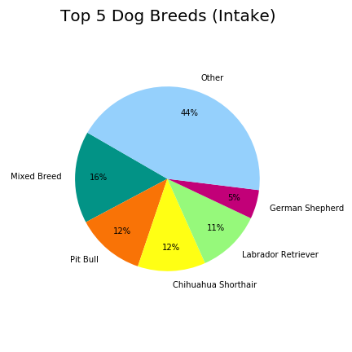
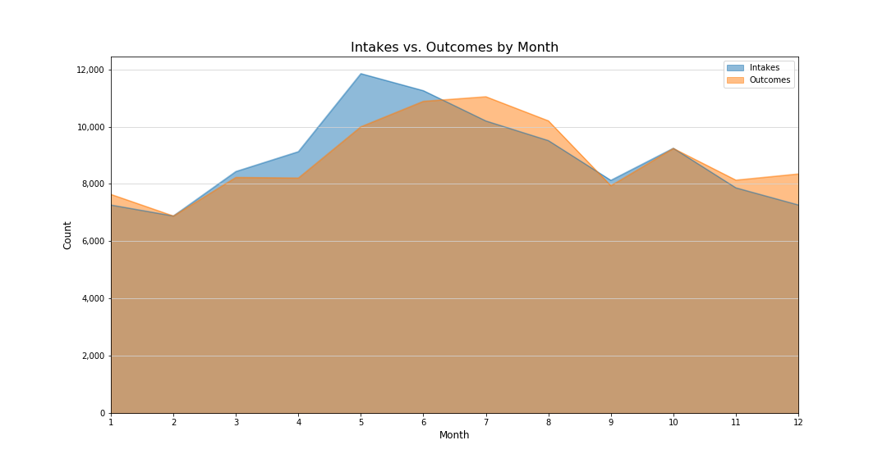

# Austin Animal Center Data Analysis

## Team Members:
Amy Koldeway, Sarah Cross, Cynthia Juarez

## Project Outline
Our project will uncover patterns of behaviors related to abandoned animals entering the Austin Animal Center.  We will examine the kinds of animals entering the facility, the frequency they are being admitted and the reasons why.  We will establish any trends or patterns based on gender, age, breed, etc. We’ll also look into the outcomes of these intakes - adoption, euthanasia, returned to owner, etc. 

### Data Sources
  * Austin Animal Center Intakes & Outcomes data sets published by the City of Austin:

    * Intake Data: 
    https://data.austintexas.gov/Health-and-Community-Services/Austin-Animal-Center-Intakes/wter-evkm

    * Outcome Data: https://data.austintexas.gov/Health-and-Community-Services/Austin-Animal-Center-Outcomes/9t4d-g238

  * Google Geocode API: https://developers.google.com/maps/documentation/geocoding/start

### Data Collection & Cleaning Methodology
* Animal Intakes and Outcomes are separate .csv files downloaded from the Austin City website for 
* Data was cleaned to parse intake and outcome dates into separate Month and Year columns, Sex on Intake was parsed into a normalized Gender column, and Age upon Intake was parsed into a new Intake Age in Months column (performed in aacdata.py script)
* Intakes and Outcomes cleaned dataset were merged into one file.  Duplicate animals (those that appeared in center more than once) were separated out from unique animals.  In combined dataset, new columns were added to calculate number of days animal spent in the center (performed in aacdata.py script)
* Cleaned combined file was filtered by animal type to separate data specific to dogs. Dog breed information was cleaned to simplify descriptions and combined all mixed breed dogs into one breed type. Data was sorted to find top five dog breeds admitted to the facility.
* Unique list of intakes and outcomes for stray cats and dogs was parsed and latitude/longitudes were found for addresses with more than just a city name.

## Questions
### What type of animals are brought into the Austin Animal Center (AAC) and for what reasons?
The Austin Animal Center is an open-intake facility where animals from all of Travis County in need are accepted regardless of age, health, species or breed. With such an wide-open policy, we wanted to see what types of animals have been brought into the center.

* Dogs and Cats are the most common types of animal brought to the AAC representing 94.3% of all intakes.
* True to their mission Birds, Livestock and 'Other' types of animals are also accepted but are admitted at a significantly lower rate than Cats or Dogs.

* A large majority of animals brought into the center are Strays representing 70% of all intakes.
* Owner Surrender is the second most common reason for acceptance into the shelter however at 19% of all intakes.
* Despite being a kill-free shelter, a very small number of animals (less than 1% of all intakes) were brought in with a Euthanasia Request.

## What type of dog is most likely to be admitted to the facility?

* The majority of dogs did not fall into a single breed as there as there were over 2,000 unique entires. The top single breed dogs types were: Pit Bull, Chihuahua, Labs and German Shepards.
* Using these percentages as a baseline, can we observe any correlation to intake reason, outcomes, adoption rate, or animals that have been returned more than once based on breed?

* Filtering intake data for the top 5 dog breeds shows the same magnitude and trend for each intake category as all animals admitted to the facility. This shows correlation between overall dog intakes and overall animal intakes. Dog breed does not have an impact on intake reason.

* Normalizing the data by intake reason shows the same relative percentage of breed for each intake reason.
* This further supports that breed does not have an impact on intake reason.

## When is an animal most likely to be admitted to the Center?
*Note: Data set is from Oct 2013 thru Aug 2019*

* Reviewing the total intakes by month year over year, we find the late spring months of May and June tend to have the most intakes while winter months of December, January and February have the lowest of intakes.

* A significant majority of all animals - over 87% - are brought to the center in a Normal condition.
* A small number of animals - under 10% - are brought to the center likely requiring medical attention to do age, injury, illness or pregnancy.

## What are the outcomes for animals brought to the center?
The AAC's mission is to provide a live outcome of at least 90% of sheltered animals through a variety of placement services. 

* A majority of all outcomes are considered "good" outcomes such as adoption, returned to owner or transfer to another shelter or foster home. With 91.69% reflecting those good outcomes, AAC is meeting their mission.
* Despite being a no-kill shelter, nearly 7% of all outcomes result in euthanasia.

In a previous chart, we showed the number of intakes by month. We wondered if a similar pattern would be found in the number of outcomes.

* Outcomes tend to follow the peaks of Incomes but at a slight delay which may be indicative of the animal's stay in the center.

### Does age play a factor in how quickly a Cat or Dog is adopted?
Since cats and dogs make up about 94% of all intakes to the center, we wanted to know if age played a factor in how long it took before an animal was adopted.

* Scatter plot of all cats and dogs adopted by age shows that younger animals tend to spend the least amount of time in the shelter.

The scatter plot is quite busy with a few hot spots, so let's take a look at the average number of days spent in the center by animal type grouped by age range.

* For both cats and dogs, the average days spent in the center before climb from ages less than 1 year to 6 years.
* Cats 15 years and older spend the longest time in the center before adoption.
* Dogs 9-12 years spend the longest time in the center before adoption.